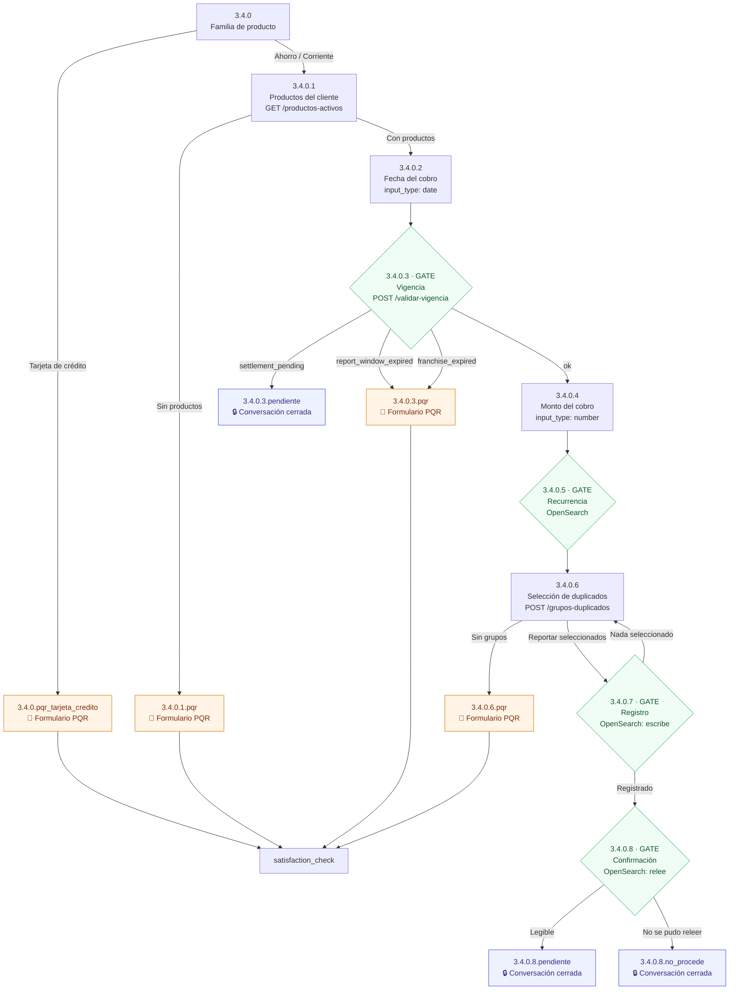

# Doble Cobro

> Especificación funcional y técnica del flujo `doble_cobro`.
> Documento de referencia para Desarrollo, QA, Arquitectura y Negocio.

---

## 1. Resumen

### Objetivo del flujo

Permitir que un cliente reporte por el canal conversacional un **cobro duplicado**
sobre una cuenta o una tarjeta débito: el bot identifica los cargos repetidos del
día indicado, deja que el cliente seleccione cuáles reportar y registra el caso
para que Negocio lo gestione.

### Estado actual

| Aspecto | Estado |
|---|---|
| Árbol conversacional | Implementado (16 pasos) |
| Reglas de negocio | Implementadas (RN-01 a RN-06) |
| Detección de duplicados | Implementada |
| Registro del caso | Implementado (OpenSearch) |
| Gestión de estados del caso | **Fuera de alcance** — el bot solo deja la información reposada |
| Radicación en Salesforce | ⚠️ Pendiente (ver §8) |

### Servicios involucrados

| Servicio | Rol |
|---|---|
| `co_pqrs_back_agent` | Conversación: pregunta, enruta y pinta. No decide reglas de negocio. |
| `co_pqrs_back_doble_cobro` | Decisiones de negocio: días hábiles, vigencia y detección de duplicados. **No persiste nada.** |
| ASO (simulador o real) | Fuente de productos y movimientos. |
| OpenSearch | Persistencia del caso. Lo escribe el **agente**, no este servicio. |

### Puertos utilizados

| Puerto | Servicio |
|---|---|
| `8000` | Agente conversacional |
| `8006` | Doble cobro |
| `8050` | Simulador ASO |
| `9200` | OpenSearch |
| `8501` | Front de pruebas |

---

## 2. Arquitectura y responsabilidades

El árbol conversacional vive en
`co_pqrs_back_agent/src/domain/workflow/doble_cobro/doble_cobro.yml`.
El servicio `:8006` resuelve las decisiones de negocio; el agente solo pregunta,
enruta y pinta.

| Capa | Ubicación | Qué hace |
|---|---|---|
| **`general.yml`** | agente | Ruteo transversal: el LLM identifica la tipología y entra al workflow `doble_cobro`. |
| **`doble_cobro.yml`** | agente | Árbol de pasos, textos al cliente y destinos. |
| **`workflows/doble_cobro_hook.py`** | agente | **Async**: llama a `:8006` y reescribe `current_step`. |
| **`actions/doble_cobro.py`** | agente | **Sync**: solo pinta lo que el hook dejó en `captured_data`. |
| **Servicio `:8006`** | este repo | Días hábiles, vigencia y detección de duplicados. No persiste nada. |

> [!IMPORTANT]
> El hook se engancha por el **nombre de la acción** declarada en el YAML, y el
> mapa paso → acción se **deriva del propio YAML al importar**
> (`_load_step_actions`). Renumerar el árbol no puede desincronizar el Python.

### Encadenamiento de gates

Los gates encadenan en un mismo turno (`3.4.0.7` → `3.4.0.8`): el hook itera
hasta llegar a un paso sin acción, con un tope de `_MAX_GATE_HOPS`.

---

## 3. Diagrama del flujo

**Recorrido nominal:**
Producto → Productos → Fecha → Vigencia → Monto → Detección → Selección → Registro → Confirmación

> [!WARNING]
> El paso `3.4.0.5` (recurrencia) aparece en el diagrama **sin rama de salida
> hacia un terminal**. La especificación original documentaba una salida
> `3.4.0.5.recurrente` que terminaba el flujo, y las pruebas actuales describen
> el comportamiento contrario. Está marcado como **PUNTO A REVISAR C-01** en §8;
> no se representa aquí para no dar por válidas dos cosas incompatibles.

---

## 4. Reglas de negocio

### RN-01 — Días hábiles de conciliación

| | |
|---|---|
| **Regla** | Antes de reclamar hay que dejar que el comercio concilie. |
| **Aplica a** | Cuentas de ahorro, cuentas corrientes y tarjetas débito **por igual**. |
| **Configuración** | `DC_SETTLEMENT_DAYS` = **7 días hábiles**. |

**Comportamiento**

Se cuentan **días hábiles colombianos**: lunes a viernes menos los 18 festivos,
con el traslado de la Ley Emiliani y los festivos derivados de la Pascua. Se
calculan, no se mantienen en tabla (`domain/doble_cobro/business_days.py`).

**Notas / restricciones**

El número que ve el cliente lo inyecta el hook en el texto del paso
`3.4.0.3.pendiente`, así que **no queda quemado en el YAML**: cambiar la variable
cambia también el mensaje.

---

### RN-02 — Vigencia

| | |
|---|---|
| **Regla** | La fecha reportada debe estar dentro de plazo para poder reclamarse. |
| **Aplica a** | Plazo general: todos los productos. Franquicia: **solo tarjetas**. |
| **Configuración** | `DC_MAX_REPORT_MONTHS` = 6 meses · VISA 180 días · MASTER 120 días |

**Comportamiento**

Se evalúan **en orden** y la primera que falla manda:

1. **Plazo general** — la fecha debe estar dentro de los últimos
   `DC_MAX_REPORT_MONTHS` = 6 meses.
2. **Vigencia de franquicia** — VISA 180 días, MASTER 120, y **180 (el plazo más
   largo) para una marca no reconocida** (AMEX, Diners o un dato incompleto).

La franquicia se deduce del **BIN del PAN** (`4` = VISA; `5` y `2` = MASTER), no
del nombre del producto. Una cuenta no tiene marca, así que la regla 2 ni se
evalúa.

**Notas / restricciones**

Como 180 días ≈ 6 meses, la regla 2 solo cambia el resultado en la práctica para
**MASTER**, en la franja entre 120 días y 6 meses.

> [!IMPORTANT]
> **No se distingue el ámbito** (nacional / interoperable / internacional). El
> tablero de negocio lo pedía, pero ningún campo del ASO lo indica: `countryId`
> describe el país donde se emitió el contrato —siempre `CO`— y no dónde ocurrió
> la compra, y la operación de `/cards/v2/operations` no trae país ni red
> adquirente. Es el mismo criterio que aplica transacción no reconocida, cerrado
> por negocio el **14/08**: manda la marca, sin ámbito.

---

### RN-03 — Detección de duplicados

| | |
|---|---|
| **Regla** | Identificar cargos repetidos entre los movimientos del día. |
| **Aplica a** | Los movimientos del producto y la fecha indicados por el cliente. |
| **Configuración** | `DC_AMOUNT_TOLERANCE` = **±2000** (solo al buscar). |

**Comportamiento**

Dos tolerancias distintas, a propósito:

| Fase | Criterio |
|---|---|
| **Al buscar** | Se admite ±2000 sobre el monto que escribió el cliente, porque rara vez lo recuerda al peso. |
| **Al agrupar** | Monto **idéntico**, **mismo comercio** y **misma fecha**. |

> [!IMPORTANT]
> **Al agrupar se exige monto exacto.** Cualquier margen en el monto produciría
> falsos positivos sobre compras distintas del mismo comercio.

> [!IMPORTANT]
> **La hora no interviene en el criterio.** Dos cargos iguales del mismo comercio
> en la misma fecha son duplicados aunque los separen horas, porque el comercio
> puede reprocesar el cobro mucho después del intento original.

Como la consulta al ASO ya filtra por `operationDate`, en la práctica se agrupa
dentro del día consultado; aun así **la fecha entra en la llave del grupo** para
que la función sea correcta por sí sola.

**Notas / restricciones**

- El comercio se compara **normalizado** (sin tildes, mayúsculas, sin
  puntuación): el ASO devuelve el mismo comercio con espaciado y acentos
  inconsistentes.
- Un movimiento **sin fecha se descarta** — es la única pieza que el criterio no
  puede suponer.
- La **hora es opcional**: solo se usa para ordenar el grupo y para mostrarle al
  cliente cuándo ocurrieron los cargos, así que un `hourOperation` ausente en el
  ASO real no impide detectar el duplicado.

---

### RN-04 — Registro del caso

| | |
|---|---|
| **Regla** | El caso se persiste para que Negocio lo gestione. |
| **Aplica a** | Las transacciones que el cliente seleccionó. |
| **Configuración** | Índice `trx-no-reconocida-cases` (ver §6). |

**Comportamiento**

El caso **no se guarda en este servicio**: vive en OpenSearch y lo escribe el
agente, en el mismo índice durable y con la misma estructura que transacción no
reconocida. Así el job de exportación a Tantia lee los dos flujos sin
distinguirlos.

> [!IMPORTANT]
> **N movimientos → N-1 reportables.** Un grupo de N cobros idénticos tiene **un
> cargo legítimo y N-1 duplicados**. Se conserva el más antiguo y se reportan los
> demás: un par produce una transacción y un triple produce dos.

**Notas / restricciones**

**El bot no gestiona estados.** El flujo solo deja la información reposada: no
escribe ni interpreta ningún estado de gestión. Negocio toma el registro y lo
trabaja por su cuenta, y eso queda fuera del alcance del agente.

Por eso el paso `3.4.0.8` se limita a comprobar que la escritura quedó legible
antes de comunicarle al cliente el plazo de abono.

---

### RN-05 — Selección de transacciones

| | |
|---|---|
| **Regla** | El cliente elige cuáles de los cargos detectados quiere reportar. |
| **Aplica a** | Paso `3.4.0.6`. |
| **Configuración** | 6 movimientos por página. |

**Comportamiento**

> [!IMPORTANT]
> **Selección múltiple.** El cliente puede marcar varios cargos; cada clic
> alterna una casilla y el paso **no avanza**.

> [!IMPORTANT]
> **Paginación.** Los movimientos se muestran de 6 en 6, con el botón
> **«Ver más movimientos»** para pasar de página.

> [!IMPORTANT]
> **La selección sobrevive entre páginas.** Lo marcado en la página 1 sigue
> contando al pasar a la página 2, aunque ya no esté a la vista.

Solo **«Reportar seleccionados»** y **«No encuentro la transacción»** sacan al
cliente del paso.

**Notas / restricciones**

Si no hay nada seleccionado, el gate de registro devuelve al selector con aviso.

---

### RN-06 — Recurrencia

| | |
|---|---|
| **Regla** | Detectar si ya existe un reporte previo para esa transacción. |
| **Aplica a** | Paso `3.4.0.5`. |
| **Configuración** | Ficha del cliente en OpenSearch. |

**Comportamiento**

> [!CAUTION]
> **PUNTO A REVISAR — C-01.** Esta regla está descrita de forma incompatible
> entre la especificación original y las pruebas vigentes. Ver §8 para el
> detalle. No se documenta aquí un comportamiento único porque **no procede
> elegirlo desde este documento**.

Contenido funcional preservado de ambas fuentes, sin resolver:

| Fuente | Qué afirma |
|---|---|
| Especificación original | La recurrencia únicamente distingue si **existe o no** un reporte previo para esa transacción. La rama `ya reportada` lleva a `3.4.0.5.recurrente` y **termina el flujo**. El registro es **acumulativo**: reportar un cobro nuevo conserva los anteriores. |
| Pruebas vigentes (caso F2) | Repetir un reporte **no debe bloquearse**. La identidad de reemplazo es **producto + fecha + monto**: el reporte anterior se **sobrescribe**. Un reporte de otro monto, otra fecha u otro producto se conserva intacto. |

---

## 5. Fuente de movimientos / ASO

`GET /cards/v2/operations`, el mismo endpoint que usa
`co_pqrs_back_trx_noreconocida`, filtrando por `operationDate` (AAAAMMDD) en
origen y recorriendo la paginación.

| Producto | Parámetro |
|---|---|
| **Tarjeta** | `cardId` = PAN |
| **Cuenta** | `accountId` = contrato |

> [!WARNING]
> **Asunción a confirmar con el ASO real.** El simulador acepta `accountId`
> (`key = card_id or account_id` en su `fastapi_app.py`). Si el ASO real solo
> admite `cardId`, hay que resolver antes el PAN de la tarjeta débito asociada a
> la cuenta. Es un cambio de adaptador en `DobleCobroAsoClient.operations`, no de
> diseño.
>
> Nótese que `financial-overview` **no** trae hoy esa relación:
> `relatedContracts` viene vacío y `detail.agreementContract` no coincide con
> ningún id de cuenta en ninguno de los **23 fixtures** del simulador.

### Nombre del comercio

El nombre del comercio viaja en el **5.º bloque de `observations`** en el ASO
real; `descProvision` allí trae un estado (`"ACEPTADA"`), no un comercio. Cuando
`observations` no trae los cinco bloques se cae a `descProvision` /
`placeOperation`.

Es la misma fragilidad documentada en TXNR y **afecta directamente al criterio
"mismo comercio"** de RN-03.

---

## 6. Registro y persistencia

| Campo | Valor |
|---|---|
| **Índice** | `trx-no-reconocida-cases` |
| **Id del documento** | `doble_cobro_<client_id>` |
| **Discriminador** | `tipo_de_notificacion: "doble_cobro"` |
| **Hito / desenlace** | `completed_report` / `devolucion` (los mismos que TXNR, para que el filtro del job no cambie) |
| **Transacciones** | `trx_case_state_snapshot.tantia_items[]`, una por cobro sobrante |

El **prefijo del id** es lo que impide que doble cobro y transacción no
reconocida se pisen la ficha del mismo cliente. Transacción no reconocida
conserva su id histórico (el `client_id` a secas) para no invalidar lo ya
guardado.

### Datos del titular pendientes

`customer_name`, `personal_id`, `customer_mail` y `customer_id` (código Altamira)
se escriben **vacíos**.

En transacción no reconocida vienen de PostgreSQL a través de los productos;
doble cobro resuelve los suyos contra el ASO, que no trae datos del titular. Los
campos quedan declarados con la misma forma para que solo haya que rellenarlos al
integrar `co_pqrs_back_data`.

---

## 7. Endpoints

| Método | Ruta | Paso |
|---|---|---|
| `GET` | `/health` | — |
| `GET` | `/v0/doble-cobro/productos-activos?customer_id=&family=` | `3.4.0.1` |
| `POST` | `/v0/doble-cobro/validar-vigencia` | `3.4.0.3` |
| `POST` | `/v0/doble-cobro/grupos-duplicados` | `3.4.0.6` |
| `POST` | `/v0/doble-cobro/analizar` | alias de `productos-activos` (compatibilidad) |

`family` acepta `SAVING`, `CHECKING` o `CREDIT_CARD`; vacío no filtra.

---

## 8. Pendientes y riesgos

### Pendientes

| Id | Descripción |
|---|---|
| **P-01** | **Radicación en Salesforce** para el camino `3.4.0.3.pqr` (fecha fuera de plazo). El Salesforce que existe en TXNR es de **solo lectura** (consulta de recurrencia); crear un caso es integración nueva. |
| **P-02** | Confirmar `accountId` contra el ASO real (ver §5). |
| **P-03** | La salida `3.4.0.8.no_procede` solo se alcanza como fail-closed: cuando el caso no se pudo escribir o releer. **Nunca por una decisión de negocio.** |

### Puntos a revisar

> [!CAUTION]
> **C-01 — Recurrencia: ¿bloquea o sobrescribe?**
>
> | Fuente | Afirma |
> |---|---|
> | Especificación original (`3.4.0.5`) | La rama «ya reportada» lleva a `3.4.0.5.recurrente` y **termina el flujo**. |
> | Pruebas vigentes (caso F2) | Repetir un reporte **no se bloquea**; el equivalente se **sobrescribe**. |
>
> Las dos descripciones **no pueden ser válidas a la vez**. Este documento no
> elige: requiere decisión de Negocio y Arquitectura.
>
> **Alcance del impacto:** el diagrama de §3, la regla RN-06 y el caso de prueba
> F2 dependen de cómo se resuelva.

> [!CAUTION]
> **C-02 — ¿El registro es acumulativo o de reemplazo?**
>
> | Fuente | Afirma |
> |---|---|
> | Especificación original (§ *El bot no gestiona estados*) | «El registro es **acumulativo**: reportar un cobro nuevo conserva los anteriores.» |
> | Pruebas vigentes (caso F2) | La identidad de reemplazo es **producto + fecha + monto**: el reporte anterior se **sobrescribe**; los de otro monto, fecha o producto se conservan. |
>
> Derivado de C-01. Pendiente de la misma decisión.

---

## 9. Checklist de liberación

### Implementación

| Estado | Elemento |
|---|---|
| ✅ | Árbol conversacional (16 pasos) en `doble_cobro.yml` |
| ✅ | RN-01 — Días hábiles de conciliación (`DC_SETTLEMENT_DAYS` = 7) |
| ✅ | RN-02 — Vigencia (plazo general + franquicia por BIN) |
| ✅ | RN-03 — Detección de duplicados (tolerancia ±2000 / agrupación exacta) |
| ✅ | RN-04 — Registro del caso en OpenSearch |
| ✅ | RN-05 — Selección múltiple con paginación |
| ⚠️ | RN-06 — Recurrencia · **bloqueada por C-01** |

### Integraciones

| Estado | Elemento |
|---|---|
| ✅ | `GET /cards/v2/operations` (movimientos) |
| ✅ | `financial-overview` (productos) |
| ⚠️ | `accountId` contra el ASO real · **P-02** |
| ⚠️ | Radicación en Salesforce para `3.4.0.3.pqr` · **P-01** |
| ⚠️ | Datos del titular (`customer_name`, `personal_id`, `customer_mail`, `customer_id`) — hoy se escriben vacíos, pendiente de integrar `co_pqrs_back_data` |

### Definición de alcance

| Estado | Elemento |
|---|---|
| ✅ | Ámbito de franquicia (nacional / interoperable / internacional) — **cerrado por negocio el 14/08**: manda la marca, sin ámbito |
| ✅ | Gestión de estados del caso — **fuera de alcance** por decisión de producto |
| ⚠️ | Recurrencia y acumulación vs reemplazo · **C-01 y C-02** |

### Verificación

| Estado | Elemento |
|---|---|
| ✅ | Matriz de casuísticas — ver [`PRUEBAS_DOBLE_COBRO.md`](PRUEBAS_DOBLE_COBRO.md) |
| ⚠️ | `3.4.0.8.no_procede` no es alcanzable end-to-end · **P-03** |
