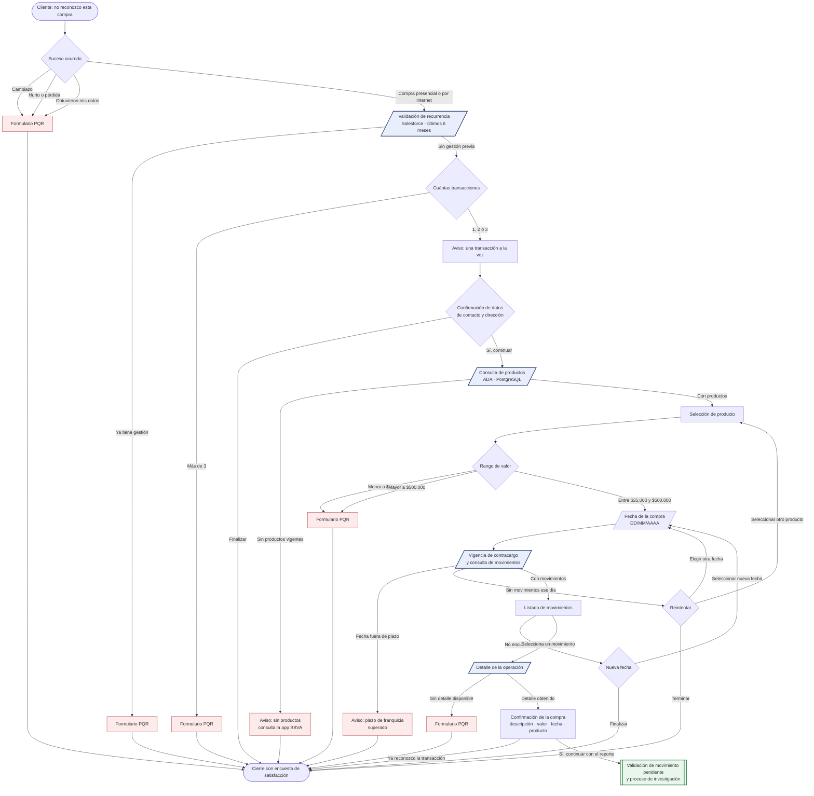
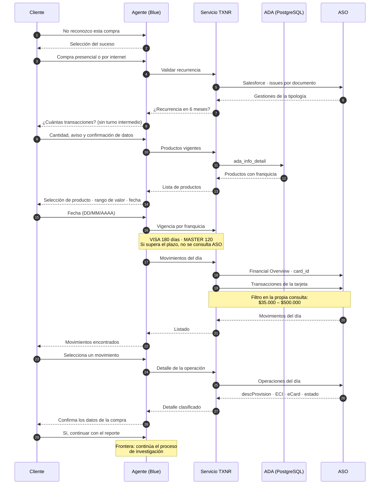
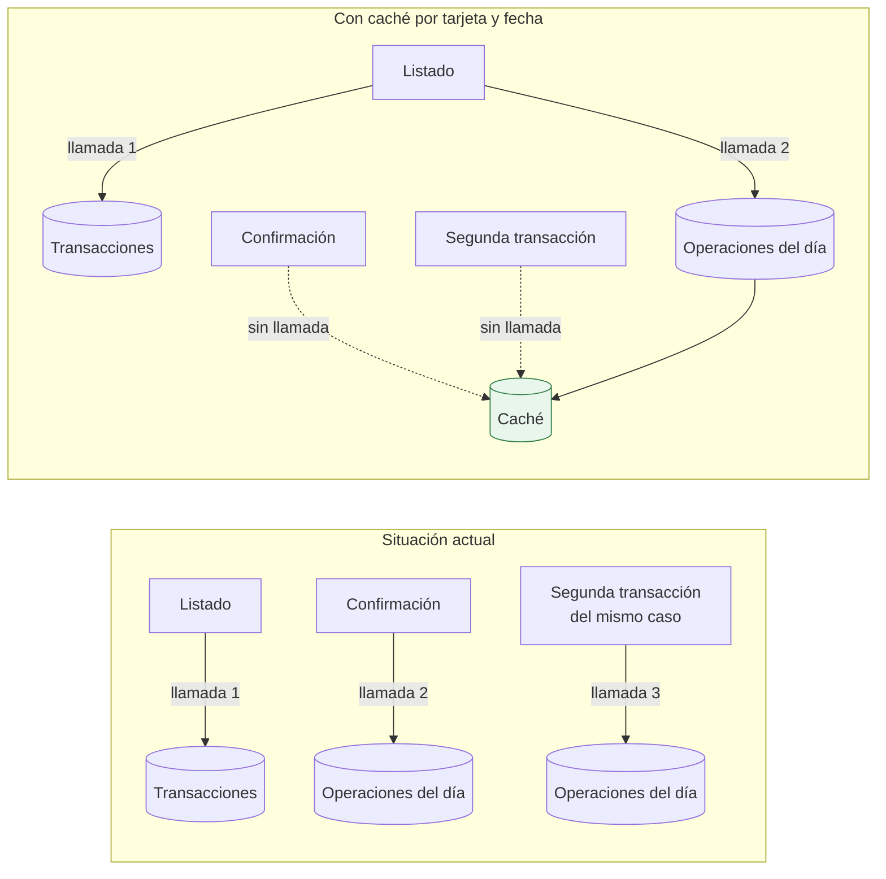

# Flujo TXNR — tramo de análisis (entrada → confirmación de la compra)

**Transacción no reconocida · BBVA Colombia** · Actualizado el 18/08/2026

Estos diagramas describen **lo implementado y verificado**, no lo previsto: se han
generado contra el árbol de pasos y las llamadas reales del agente y del servicio.

**Alcance:** desde la entrada al flujo hasta la confirmación de la compra
(`2.4.0.1.11`). Desde la validación de movimiento pendiente (`2.4.0.1.12`) en adelante
corresponde al otro tramo del equipo y se muestra sólo como frontera.

---

## 1 · Recorrido conversacional

Los bloques con borde azul son **puntos de consulta a sistemas**: se ejecutan sin turno
de conversación —el cliente no ve un "estoy validando"— y encaminan según el resultado.

---

## 2 · Servicios consultados y momento de la llamada

---

## 3 · Simplificación (implementada el 18/08)

Hoy el detalle se consulta **una vez por cada movimiento** que el cliente selecciona,
aunque el servicio devuelve **todas las operaciones del día** en una sola respuesta.

**Efecto medido:** con tres movimientos distintos del mismo día, el servicio hace **una
sola** consulta de operaciones en vez de tres. La descripción de la confirmación pasa a
tomarse de `descProvision` (la glosa del establecimiento), con el concepto del listado
como respaldo.

**Precisión importante:** el listado y el detalle son **dos servicios ASO distintos**
—transacciones de tarjeta y operaciones— y el segundo es el único que aporta ECI, eCard
y estado de la operación, que son los campos que deciden el desenlace del caso. No pueden
unificarse en una sola llamada sin perder esa clasificación; lo que sí se elimina es la
**repetición** de la segunda.

---

## 4 · Reglas de negocio vigentes

| Regla | Valor | Dónde se aplica |
|---|---|---|
| Transacciones por caso | hasta 3 | selección de cantidad |
| Rango por transacción | $35.000 – $500.000 | **filtro en la consulta al ASO**, no en memoria |
| Vigencia de contracargo | VISA 180 días · MASTER 120 | antes de consultar movimientos |
| Recurrencia | gestión de la misma tipología en 6 meses | al entrar al flujo |
| Formato de fecha | se solicita `DD/MM/AAAA` | se aceptan además `DD-MM-AAAA`, `AAAA-MM-DD` y sin ceros; una fecha futura se rechaza con aviso propio |

---

## 5 · Estado de verificación

| Comprobación automática | Alcance | Resultado |
|---|---|---|
| Recorridos extremo a extremo | 17 escenarios del tramo | 17 / 17 |
| Contrato con el tramo siguiente | 25 claves de la entrega | 25 / 25 |
| Exactitud de los mensajes con datos del cliente | 61 comprobaciones | 61 / 61 |
| Documentación de pruebas contra el sistema real | 25 recorridos | 25 / 25 |

Los mensajes que muestran datos del cliente se verifican **contra la fuente del dato**
—no contra un texto fijo—, comprobando procedencia, formato, comportamiento ante datos
ausentes y limpieza entre pasos.
