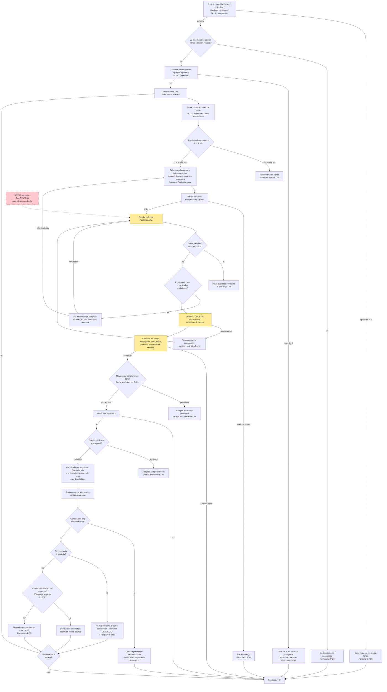
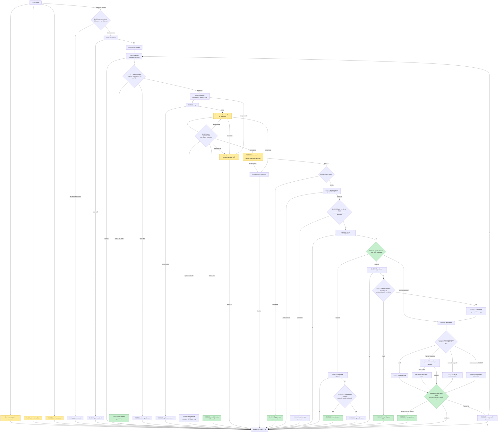

# Comparativa — el tablero original vs la implementación actual

**Fecha:** 21/08/2026 · **Rama:** `fix/merge-trx-costuras`
**Fuentes:** las 17 capturas del tablero V.2 (13/08, `.claude/Roadmap_Pieces/`) contra el
grafo **real** extraído del YAML (`trx_no_reconocida.yml`, 48 pasos) y de los gates de
`chat_service.py` — no de memoria.

**Cómo leer los diagramas** (misma leyenda en ambos):

| Estilo | Significado |
|---|---|
| nodo azul (por defecto) | igual en tablero y código |
| nodo **verde** | existe **sólo en el código** — robustez añadida (fail-closed, candados, cierre del bucle) |
| nodo **amarillo** | existe en ambos pero **se comporta distinto** — divergencia documentada |
| nodo **rojo punteado** | el tablero lo pide y **no está** en el código |
| rombo | decisión automática (gate que el cliente no ve) |

Se renderizan en cualquier visor de Mermaid (VS Code, mermaid.live, GitLab/GitHub).

---

## 1 · El TABLERO, como lo dibujó el PO

Lo verde-sombreado del tablero (backoffice) queda fuera: no es alcance del bot.



---

## 2 · El CÓDIGO, hoy (48 pasos, gates reales)

Los rombos son los **gates automáticos**: pasos con acción que el cliente nunca ve porque
`chat_service` reescribe el destino en el mismo turno.



---

## 3 · Las diferencias, en una tabla

### 3.1 · Lo que el código AÑADE sobre el tablero (verde)

| Nodo | Por qué existe |
|---|---|
| `.4.error` / `.8.error` / `.10.pqr` | **fail-closed**: antes que afirmar «no tienes productos» o «no hay compras» con el servicio caído, un aviso honesto + formulario (petición de Fabián) |
| `.16.1.pqr` / `.17.1.pqr` | el bloqueo puede **fallar**: el tablero no lo contempla |
| candados de los gates de bloqueo | evitan la **doble reexpedición** de tarjeta ante un reintento |
| salto de `.15` → `.18` | no volver a pedir el bloqueo de una tarjeta **ya bloqueada** en esta conversación |
| `.20.0` + `.20.2` | los **cuatro** desenlaces ofrecen reportar la siguiente, y el cierre es explícito («ya reportaste todas») — sólo para quien declaró 2-3 |
| gate `.8` sin memoria de fallos | un error técnico no se convierte en «no hay compras» mañana |

### 3.2 · Lo que difiere en comportamiento (amarillo)

| Ítem | Tablero | Código | Estado |
|---|---|---|---|
| Listado `.9` | *todos* los movimientos, **incluidos abonos** | tope 5 + aviso de resto; filtro `EXPENSE` excluye abonos | decisión de negocio pendiente (H-14-3) |
| Fecha `.7` | **calendario** de un día | texto libre `DD/MM/AAAA` con reprompt | widget del front, no del bot |
| Sucesos 1-3 | **un** mensaje común | tres pasos (`2.4.1/2/3`), dos con texto idéntico | cosmético |
| Máscara de confirmación | `••••xxxx` | `*xxxx` | decisión **explícita** de Fabián (20/08) que prevalece sobre el tablero |

### 3.3 · Lo que el tablero pide y NO está (rojo punteado)

| Ítem | Nota |
|---|---|
| Calendario en `.7` | requiere trabajo de **front**; el bot no puede pintarlo |

### 3.4 · Lo que ya NO difiere (cerrado esta semana)

Copys del selector, sucesos 3-4, colas de `2.4.2`/`2.4.3`, ítems del listado, «No
encuentro…» con punto, viñeta de descripción cruda, tipo de producto interpolado, tildes
completas, máscaras (`•` selector/bloqueos, `*` confirmación), «Monto devuelto» del
reembolso, regla de pendiente por `observations`, regla ECI con el `0`, y la dirección real
en la reexpedición.

---

## 4 · Cómo mantener esto vivo

El diagrama del código sale del YAML y de los gates: si el flujo cambia, **este fichero
queda viejo**. La fuente de verdad operativa sigue siendo `ESPECIFICACION_FLUJO.md` + el
YAML; esta comparativa es una foto para la conversación con Fabián y PO. Si se quiere
regenerar, el volcado del grafo está a un comando:

```bash
cd co_pqrs_back_agent && uv run --with pyyaml python - <<'EOF'
import yaml
S=yaml.safe_load(open("src/domain/workflow/trx_no_reconocida/trx_no_reconocida.yml"))["steps"]
for k,s in S.items():
    for o in (s.get("options") or []):
        print(f"{k} --[{o.get('label')}]--> {o.get('next_step')}")
EOF
```
